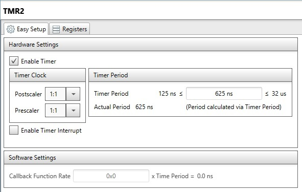
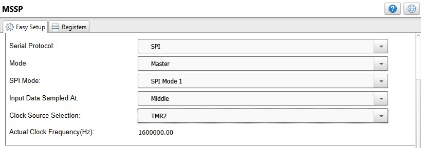
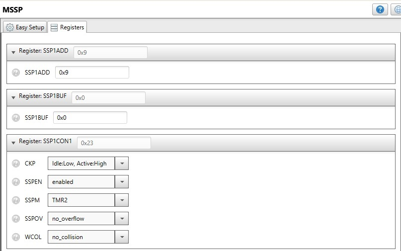

# PIC16F1717 WS2812 Proteus

This project contains a led driver for the [WS2812](https://cdn-shop.adafruit.com/datasheets/WS2812B.pdf) using the PIC16F1717, the source code is developed using [MPLABX](https://www.microchip.com/en-us/development-tools-tools-and-software/mplab-x-ide) and it is simulated on [Proteus](https://www.labcenter.com/simulation/).

## Table of Contents

1. [About the Project](#about-the-project)
2. [Getting Started](#getting-started)
    1. [Dependencies](#dependencies)
    2. [Getting the Source Code](#getting-the-source-code)
3. [PIC16F1717 Configuration MCC](#pic16F1717-configuration-mcc)
4. [Simulation Results](#simulation-results)
5. [Further Reading](#further-reading)
6. [Author](#author)

# About the Project

The following image presents the project in Proteus:


# Getting Started

## Dependencies

The project only requires the following development environments:

* [MPLABX](https://www.microchip.com/en-us/development-tools-tools-and-software/mplab-x-ide)
* [Proteus](https://www.labcenter.com/simulation/)

The Proteus project uses components the are contained in the environment by default, doesn't require additional component imports.

**[Back to top](#table-of-contents)**

## Getting the Source Code

This project is [hosted on GitHub](https://github.com/leonardoward/pic16-ws2812-proteus). You can clone this project directly using this command:

```
git clone https://github.com/leonardoward/pic16-ws2812-proteus.git
```

**[Back to top](#table-of-contents)**

# PIC16F1717 Configuration MCC

The project applies the ideas of the [Application Notes AN1606](http://ww1.microchip.com/downloads/en/appnotes/00001606a.pdf) to create the signal for the WS2812. This approach requires the configuration of a timer, a master SPI, a PWM and a CLC. For detailed explanations about why the configuration is made this way visit the [Application Notes AN1606](http://ww1.microchip.com/downloads/en/appnotes/00001606a.pdf), and the article [Interfacing with WS2812 Neopixel LED Arrays](https://mplabxpress.microchip.com/mplabcloud/example/details/503).

## Oscillator ##

* Easy setup


## TIMER2 ##

* Easy setup



## PWM4 ##

* Easy setup


* Pin Manager


## MSSP (SPI Master) ##

* Easy setup



* Pin Manager


* Registers




## CLC3 ##

* Easy setup


* Pin Manager


# Simulation Results

This test sets all the pixels (8) in the color red, after that there is a delay of 2 ms for the rest. This code is located in the infinite loop, therefore the microcontroller does a refresh of the color of every pixel.

It works in some occasions, but not always, the following two pictures were taken in the same test.


# Further Reading

* [WS281x datasheet](https://cdn-shop.adafruit.com/datasheets/WS2812B.pdf)
* [Application Notes AN1606 - Using the Configurable Logic Cell (CLC) to Interface a PIC16F1509 and WS2811 LED Driver](http://ww1.microchip.com/downloads/en/appnotes/00001606a.pdf)
* [Interfacing with WS2812 Neopixel LED Arrays (PIC16F18855)](https://mplabxpress.microchip.com/mplabcloud/example/details/503)
* [WS281x using PIC](https://blog.kubovy.eu/2019/02/17/ws281x-using-pic/)
* [8x32 NeoPixel LED PIC18FxxK42](https://mplabxpress.microchip.com/mplabcloud/example/details/378)

**[Back to top](#table-of-contents)**

# Author

* **[Leonardo Ward](https://github.com/leonardoward)**

**[Back to top](#table-of-contents)**
